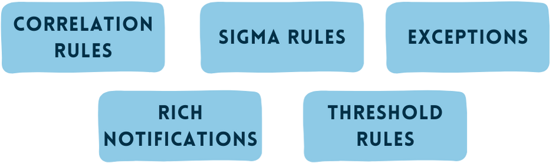
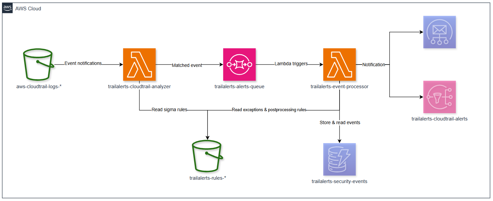
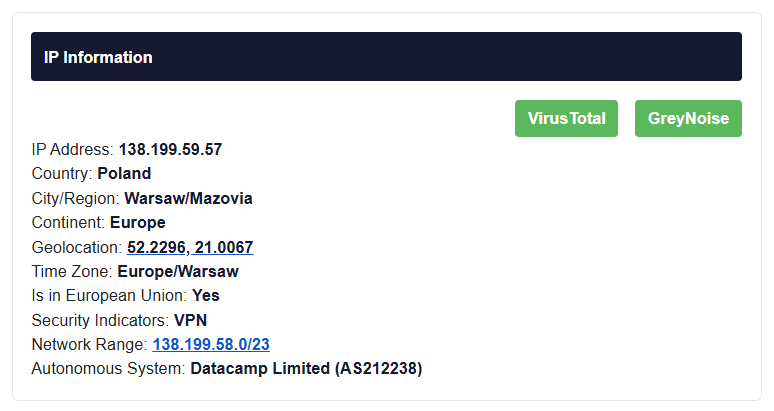

<p align="center">
  
</p>
<p align="center">
  
</p>

# TrailAlerts

Public [Terraform registry module](https://registry.terraform.io/modules/adanalvarez/trailalerts/aws/latest) to deploy TrailAlerts, a native, serverless cloud-detection tool (not a SIEM) that lets you define simple rules (written in open Sigma syntax) as code and get rich alerts about events in AWS.

It is aimed at people/companies who do **not** need a SIEM but still want ownership of their detections and find CloudWatch or EventBridge rules hard to manage.

* **Sigma rules:** Drop in community Sigma rules or write your own and version-control them with the rest of your infrastructure.
* **Total control of the alerting pipeline:** Decide exactly what you want to see, correlate related events, and publish notifications via SNS, SES or webhook.
* **Optional web dashboard:** Enable a fully integrated dashboard to browse alert history, manage Sigma rules, post-processing rules and exceptions.
* **All-serverless:** Built on Lambda, S3, SQS and DynamoDB, so you pay only for what you actually run.

## Motivation

While developing [TrailDiscover](https://traildiscover.cloud/) I confirmed my initial hunch: attackers repeat the same techniques and target the same AWS services, meaning a small set of good detections can catch many real-world attacks.

Current scenario seems to be as following:

* **Big enterprises** usually ship CloudTrail to a SIEM and create custom alerting there.  
* **Smaller organisations and personal accounts** turn on GuardDuty and hope for the best.

GuardDuty is excellent and I recommend keeping it enabled, but I wanted finer control over alerts.  
After testing the native options (which I wrote up in “[DIY — Evaluating AWS Native Approaches for Detecting Suspicious API Calls](https://medium.com/p/c6e05de97a49)”) I found CloudWatch and EventBridge rules difficult to manage and limited in correlation logic.

TrailAlerts fills that gap: the power to write your own rules without the cost or complexity of a SIEM, and without the pain of hand-crafting CloudWatch or EventBridge patterns.

## Table of Contents

- [Overview](#overview)
- [Architecture](#architecture)
- [Technical Details](#technical-details)
  - [CloudTrail Analyzer Lambda](#cloudtrail-analyzer-lambda)
  - [Event Processor Lambda](#event-processor-lambda)
  - [Rules Structure](#rules-structure)
    - [Exception Rules](#exception-rules)
    - [Post-Processing Rules](#post-processing-rules)
  - [Detection Rules](#detection-rules)
  - [Correlation and Threshold Engine](#correlation-and-threshold-engine)
  - [Notification System](#notification-system)
- [Web Dashboard (Optional)](#web-dashboard-optional)
- [Infrastructure](#infrastructure)
- [Enrichment](#enrichment)
- [Rule Compatibility](#rule-compatibility)
- [Cost Considerations](#cost-considerations)
- [Contributing](#contributing)
- [Setup and Deployment](#setup-and-deployment)

## Overview

TrailAlerts is designed to provide security monitoring for AWS environments by analyzing CloudTrail logs for suspicious or malicious activities. It leverages the open-source Sigma rules format to define detection patterns, allowing for easy customization and expansion of detection capabilities.

Key features:
- Almost real-time CloudTrail event monitoring (CloudTrail publishes log files multiple times an hour, about every 5 minutes.)
- Based on industry-standard Sigma rules format
- Event correlation for detecting attack patterns
- Customizable alerting thresholds and notification settings
- Serverless architecture for cost-efficiency and scalability
- Allow exceptions based on IPs or identity
- Optional web dashboard for alert history, rule management and exceptions
- Terraform-managed infrastructure

## Architecture

The system uses a serverless architecture built around AWS Lambda, SQS, DynamoDB, and other AWS services:



1. CloudTrail logs are stored in an S3 bucket
2. The CloudTrail Analyzer Lambda function processes new log files as they arrive
3. When a log event matches a Sigma rule, it's sent to an SQS queue
4. The Event Processor Lambda consumes messages from the queue
5. If `correlation_enabled` is enabled, events are stored in DynamoDB for alert history, cooldown tracking, threshold checks and correlation matching
6. Matching events are filtered by severity/cooldown and then sent through the configured notification channels
7. *(Optional)* If the dashboard is enabled, rules can be managed through the web UI; alert history and stats are available when DynamoDB is configured

## Technical Details

### CloudTrail Analyzer Lambda

The CloudTrail Analyzer Lambda (`SigmaCloudTrailAnalyzer`) is triggered by S3 events when new CloudTrail gzip logs are delivered. The S3 notification is filtered to `.json.gz` objects before invocation, and you can optionally narrow it further with `cloudtrail_log_filter_prefix` for existing buckets that store CloudTrail logs under a known prefix. It:

1. Downloads and decompresses the CloudTrail log file
2. Fetches and parses Sigma rules from the rules S3 bucket, using warm-runtime caches to reduce repeated S3 list/get operations
3. For each event in the log file, checks if it matches any Sigma rule
4. When matches are found, formats the alert data and sends it to SQS

The analyzer uses an efficient, two-stage approach:
- First pass: Fast filtering of events by eventSource and eventName
- Second pass: Detailed rule evaluation with full pattern matching

The Lambda implements a caching system that limits S3 list operations to at most once every 5 minutes, optimizing performance and reducing API call costs when frequently invoked. If a rule reload fails after a previous successful load, the analyzer keeps the last known good rule cache and index.

### Event Processor Lambda

The Event Processor Lambda (`SigmaEventProcessor`) handles events from the SQS queue and:

1. Extracts data from the event
2. Checks if the event should be excluded based on exception rules
3. If DynamoDB is enabled it:
  - Stores dashboard-visible alert history records
  - Implements cooldown periods to prevent alert flooding
  - Checks correlation rules
  - Checks threshold rules
4. Checks alert severity against notification thresholds
5. Formats and sends notifications via webhook, SNS or SES depending on configuration

SQS messages are processed with partial batch failure handling, so a failed message can be retried without forcing successful messages in the same batch to run again.

Key modules in the Event Processor:
- `lambda_function.py`: Main handler and orchestration
- `cloudtrail_helpers.py`: Functions for processing CloudTrail event data
- `correlation_helpers.py`: Implements event correlation logic
- `dynamodb_helpers.py`: Functions for interacting with DynamoDB for storage
- `email_helpers.py`: Email notification formatting and delivery
- `ip_helpers.py`: IP address validation and enrichment
- `notification_helpers.py`: General notification handling
- `threshold_helpers.py`: Alert threshold management
- `utils.py`: General utility functions
- `styles.py`: HTML email styling
- `constants.py`: Configuration constants
- `exception_helpers.py`: Exception handling and management
- `webhook_helpers.py`: JSON webhook notification delivery
- `plugins/`: Event-source plugin system used to route CloudTrail events and provide a generic fallback

### Rules Structure

The system organizes detection and post-processing configuration as objects in the TrailAlerts rules S3 bucket:

```
s3://<trailalerts-rules-bucket>/
├── sigma_rules/           # Contains Sigma YAML rule definitions
│   ├── aws_cloudtrail_disable_logging.yml
│   ├── aws_console_login_without_mfa.yml
│   └── ...
├── disabled_sigma_rules/  # Dashboard-disabled Sigma rules kept out of analyzer matching
├── exceptions.json        # Exception rules for filtering out benign events
└── postprocessing_rules/  # Contains post-processing rules
    ├── correlation_iam.json  # Correlation rules focused on IAM
    ├── correlation_s3.json   # Correlation rules focused on S3 operations
    ├── thresholds.json       # Threshold rules for various alerts
    └── ...
```

#### Exception Rules

Exception rules (defined in `exceptions.json`) allow you to suppress alerts based on specific criteria such as source IP addresses or user identities. These exceptions prevent notification fatigue from known legitimate activities.

Example `exceptions.json` structure:
```json
{
    "AWS SecretsManager GetSecretValue": {
        "excludedActors": ["arn:aws:iam::123456789012:user/ci-bot", "arn:aws:iam::123456789012:role/app-sync"],
        "excludedSourceIPs": ["10.0.1.100"],
        "excludedActorsRegex": ["^AWSReservedSSO_AdministratorAccess.*"]
    },
    "AWS Console Login": {
        "excludedActors": ["arn:aws:iam::123456789012:user/monitoring"]
    }
}
```

Each exception rule uses the Sigma rule title as the key and can include:
- `excludedActors`: List of ARNs for IAM users or roles to exclude
- `excludedSourceIPs`: List of IP addresses to exclude
- `excludedActorsRegex`: List of regex patterns to match and exclude IAM entities

#### Post-Processing Rules

Post-processing rules (stored as JSON files in the `postprocessing_rules/` directory) allow you to define additional processing logic that happens after matching events against Sigma rules. The lambda can process multiple JSON files in this directory, each focusing on different types of rules or different AWS services.

You can organize post-processing rules into multiple files for better management. For example:
- `correlation_iam.json` for IAM-related correlation rules
- `correlation_s3.json` for S3-related correlation rules
- `thresholds.json` for threshold rules

The system supports two types of post-processing rules:

##### 1. Correlation Rules:
Correlation rules detect relationships between different alert types within a specified time window.

```json
[
  {
    "type": "correlation",
    "sigmaRuleTitle": "AWS CloudTrail Attach Policy",
    "lookFor": "AWS CloudTrail IAM User Creation",
    "windowMinutes": 15,
    "severity_adjustment": "high",
    "description": "User creation followed by policy attachment"
  }
]
```

Each correlation rule includes:
- `type`: Must be "correlation"
- `sigmaRuleTitle`: The title of the triggering Sigma rule
- `lookFor`: The title of another Sigma rule to correlate with
- `windowMinutes`: Time window for correlation
- `severity_adjustment`: How to adjust severity when correlation is found
- `description`: Description of the correlation pattern

Correlation is checked in both directions. If the triggering event arrives before the `lookFor` event, or the `lookFor` event arrives first, the processor can still identify the relationship as long as both events are within the configured window.

##### 2. Threshold Rules:
Threshold rules detect when the same alert occurs multiple times within a time window.

```json
[
  {
    "type": "threshold",
    "sigmaRuleTitle": "AWS SecretsManager GetSecretValue",
    "thresholdCount": 10,
    "windowMinutes": 5,
    "severity_adjustment": "medium",
    "description": "Multiple SecretsManager accesses by same actor in short time window"
  }
]
```

Each threshold rule includes:
- `type`: Must be "threshold"
- `sigmaRuleTitle`: The title of the Sigma rule to monitor
- `thresholdCount`: Number of occurrences needed to trigger
- `windowMinutes`: Time window for counting occurrences
- `severity_adjustment`: How to adjust severity when threshold is exceeded
- `description`: Description of the threshold alert

You can add multiple rule files to the post-processing directory, and the Lambda will automatically load and process all JSON files found there, making the system highly extensible and easy to organize.

### Detection Rules

The system uses Sigma rules stored in YAML format under the `sigma_rules/` S3 prefix. Each rule consists of:

- Title and description
- Tags and references
- Severity level
- Detection logic (conditions to match in CloudTrail events)
- Potential false positive scenarios

Example rule structure:
```yaml
title: AWS Security Group Change
id: 123456-abcd-1234-5678-1234567890ab
status: test
description: Detects changes to security groups
references:
    - https://example.com/reference
author: Security Team
date: 2023-01-01
tags:
    - attack.impact
    - attack.t1123
logsource:
    product: aws
    service: cloudtrail
detection:
    selection_source:
        eventSource: ec2.amazonaws.com
        eventName: 
          - AuthorizeSecurityGroupIngress
          - AuthorizeSecurityGroupEgress
    condition: selection_source
falsepositives:
    - Legitimate security group changes
level: medium
```

Rules can be uploaded directly to S3 or managed through the optional dashboard. The dashboard editor validates required Sigma fields inline, can test a rule against a sample CloudTrail event, and only enables save/deploy when the rule is valid. Disabled rules are moved to the `disabled_sigma_rules/` prefix instead of adding TrailAlerts-specific fields to the Sigma YAML, so the active analyzer path only reads standard Sigma documents from `sigma_rules/`.

### Correlation and Threshold Engine

When `correlation_enabled = true`, TrailAlerts creates a DynamoDB table used for alert history, cooldown state, correlation tracking and threshold windows. Records are written with TTL-based expiration so old investigation context is cleaned up automatically.

The event processor supports two kinds of post-processing logic:

1. **Correlation rules** detect relationships between different Sigma rule titles within a configured time window. These are useful for multi-step activity such as user creation followed by policy attachment.
2. **Threshold rules** detect repeated occurrences of the same Sigma rule by the same actor within a configured time window.

Correlation and threshold matches can raise the alert severity and add context to notifications and dashboard records, making it easier to investigate privilege escalation chains, repeated access patterns or other multi-stage behavior.

### Notification System

The notification system supports:

1. **SES email** — Rich HTML emails with event details, resources affected, and context
2. **SNS topic** — Simple text notifications for quick integrations
3. **Webhook** — JSON POST to any HTTP endpoint (e.g. Slack, PagerDuty, Tines, a custom SIEM ingestion URL). Supports custom headers for authentication.
4. Severity-based filtering (only alert on certain severity levels)
5. Cooldown periods to prevent alert fatigue

Webhook notifications can run alongside the configured email path. When SNS is enabled, the processor publishes to SNS; when SNS is not configured and SES settings are present, the processor falls back to SES. SNS and SES are therefore alternatives, while webhook is additive.

The webhook sends a JSON payload containing the full CloudTrail event, Sigma rule metadata, and any correlation or threshold context:

```json
{
  "source": "TrailAlerts",
  "timestamp": "2026-04-05T12:00:00+00:00",
  "rule": {
    "title": "AWS Console Login Without MFA",
    "level": "high",
    "description": "..."
  },
  "event": {
    "eventName": "ConsoleLogin",
    "eventSource": "signin.amazonaws.com",
    "sourceIPAddress": "1.2.3.4",
    "userIdentity": { "..." : "..." }
  }
}
```

### Web Dashboard (Optional)

When `enable_dashboard = true`, TrailAlerts deploys a lightweight web dashboard that gives you a browser-based interface for operating and monitoring the detection pipeline. The dashboard is entirely optional — all core detection and alerting capabilities work without it.

The dashboard lets you:

- **View alert history** — browse, filter and sort alerts by time, severity, rule name, or actor with paginated results when DynamoDB is enabled.
- **Manage Sigma rules** — create, clone, validate, test, bulk enable/disable/delete, save and delete Sigma rules in a YAML editor with line numbers, inline validation, dirty-state save controls and S3-backed version history.
- **Manage post-processing rules** — add or modify correlation and threshold rules in a JSON editor with line numbers, validation, schema hints, dirty-state save controls and safer delete/back handling.
- **Manage exceptions** — define excluded actors, IPs and regex patterns per rule in a JSON editor with line numbers, validation, schema hints, dirty-state save controls and safer delete/back handling.
- **Overview** — see a 24-hour summary with total alerts, severity breakdown, previous-period deltas, an alert trend and top-triggered rules.

**Architecture:**

| Component | AWS Service |
|-----------|-------------|
| Authentication | Cognito User Pool with username/password + optional MFA |
| API | API Gateway (HTTP) → Lambda (`DashboardAPI`) |
| Frontend | S3 (static site) → CloudFront |
| Storage | Same DynamoDB table used by the Event Processor, required for alert history and stats |

The frontend is a zero-dependency vanilla JS application served via CloudFront, with the API proxied through the same distribution under `/api/*`. The dashboard uses a same-origin API path by default, so API Gateway CORS is disabled unless you explicitly set `dashboard_api_cors_allowed_origins` for direct browser access to the API endpoint.

Admin users are created from the `dashboard_admin_emails` variable and receive a temporary password by email on first deploy.

Rule, post-processing and exception management works through S3. The rules bucket has versioning enabled so dashboard-managed Sigma rules can show save history and reload prior versions. Enabling or disabling a rule moves the same YAML object between `sigma_rules/` and `disabled_sigma_rules/`; disabled rules remain editable but are not loaded by the CloudTrail Analyzer. Alert history, alert detail and overview statistics require `correlation_enabled = true`, because that is what creates and wires the DynamoDB table used by both the Event Processor and dashboard API.

## Infrastructure

The infrastructure is defined as a reusable Terraform module at the repository root, with implementation split across the `modules/` directory. Key components include:

- Lambda functions with appropriate IAM roles and permissions
- SQS queue for alert message handling
- S3 bucket for Sigma rules (optionally for CloudTrail)
- DynamoDB table for event correlation and dashboard history (optional)
- CloudWatch Log groups for Lambda logging
- SNS topics for notifications (optional)
- Cognito User Pool, API Gateway, CloudFront and S3 static site for the dashboard (optional)

Infrastructure is parameterized through module variables, allowing for easy customization of:

- Email source and destination
- Notification settings
- Cloudwatch logs Retention periods
- Security thresholds
- Correlation options

### Enrichment

TrailAlerts supports basic alert enrichment to provide additional context for detected events. By integrating with external services, you can enhance the information included in alert notifications.

#### VPNAPI.io Integration

To enrich alerts with IP-related information, you can use the [VPNAPI.io](https://vpnapi.io/) service. This requires an API key, which can be passed through the `vpnapi_key` module variable.

When the API key is configured, TrailAlerts will query VPNAPI.io for details about the source IP address associated with an event. The enriched data will be included in email notifications, providing insights such as:

- Whether the IP is associated with a VPN or proxy
- Geolocation details (e.g., country, city)
- ISP information



## Rule Compatibility

TrailAlerts supports a subset of the Sigma rule format, specifically optimized for CloudTrail logs. While not all Sigma features are supported, the system efficiently processes the most common patterns needed for CloudTrail security monitoring.

Compatible rule features:
- **Field exact matching**: Exact matching on fields like `eventSource: ec2.amazonaws.com`
- **List matching**: Match any value from a list, e.g., `eventName: ["AuthorizeSecurityGroupEgress", "AuthorizeSecurityGroupIngress"]`
- **Nested CloudTrail fields**: Dot-notation lookups such as `userIdentity.type`
- **String modifiers**: `|contains`, `|startswith`, `|endswith` and `|re`
- **Field references**: Basic `|fieldref` comparisons between values in the same CloudTrail event
- **Simple condition logic**: Rules can use basic conditions like `condition: selection` or `condition: 1 of selection_*`
- **Basic logical operations**: AND logic is implied when multiple fields are in the same selection block; simple `and`, `or` and `not` expressions are supported between detection blocks

The system uses a two-stage approach to efficiently process rules:
1. Fast initial filtering by `eventSource` and `eventName`
2. More detailed pattern matching on the filtered events

The matcher is intentionally optimized for CloudTrail detections rather than the full Sigma specification. Rules that include exact `eventSource` and `eventName` values are indexed for fast candidate selection; rules that use modifiers or do not expose both fields are evaluated as wildcard candidates.

## Cost Considerations

TrailAlerts is designed to be cost-efficient through its serverless architecture, but there are several AWS costs to consider:

1. **Lambda Execution Costs**:
   - CloudTrail Analyzer Lambda: Invoked for each new CloudTrail log file
   - Event Processor Lambda: Triggered for each matching event
   - Costs scale with CloudTrail volume and rule match frequency

2. **Storage Costs**:
   - S3 storage for CloudTrail logs
   - DynamoDB storage for correlation data (if enabled)
   - CloudWatch Logs for Lambda function logs

3. **S3 Operation**:
   - Get log files from S3 and decrypt them
   - List and get rules from S3

4. **SQS and SNS**:
   - SQS message processing (modest for most deployments)
   - SES/SNS notifications (minimal)

Actual costs will vary based on CloudTrail volume, rule matching frequency, and AWS region pricing.

For an account with not much traffic costs should be under $10 month.

## Setup and Deployment

This repository is a reusable Terraform module to deploy the TrailAlerts serverless stack (Lambdas, SQS, SNS/SES, optional DynamoDB, S3, IAM).

Quick usage (minimal — alerts only, no dashboard):

```hcl
module "trailalerts" {
  source  = "adanalvarez/trailalerts/aws"
  version = "0.2.2"

  aws_region     = "us-west-2"
  email_endpoint = "alerts@example.com"
  source_email   = "alerts@example.com"
}
```

With the optional dashboard:

```hcl
module "trailalerts" {
  source  = "adanalvarez/trailalerts/aws"
  version = "0.2.2"

  aws_region     = "us-west-2"
  email_endpoint = "alerts@example.com"
  source_email   = "alerts@example.com"

  correlation_enabled   = true
  enable_dashboard       = true
  dashboard_admin_emails = ["admin@example.com"]
}
```

With webhook notifications (runs alongside SNS by default):

```hcl
module "trailalerts" {
  source  = "adanalvarez/trailalerts/aws"
  version = "0.2.2"

  aws_region     = "us-west-2"
  email_endpoint = "alerts@example.com"
  source_email   = "alerts@example.com"

  webhook_url = "https://your-siem.example.com/api/webhook"
  webhook_headers = {
    "Authorization" = "Bearer your-token"
  }
}
```

After `terraform apply`, the dashboard URL is available in the `dashboard_url` output. Admin users receive a temporary password by email.

If you already have a CloudTrail bucket, set `create_cloudtrail = false` and provide `existing_cloudtrail_bucket_name`.

See the `examples/` folder for a runnable example. Required Terraform variables are `aws_region` and `email_endpoint`; the current Event Processor runtime also expects `source_email` to be non-empty. Common outputs include CloudWatch Log Group ARNs: `trailalerts_cloudtrail_analyzer_log_group_arn` and `trailalerts_event_processor_log_group_arn`.

Notes:
- The analyzer Lambda S3 trigger only invokes on `.json.gz` objects. For existing buckets with a known CloudTrail path prefix, set `cloudtrail_log_filter_prefix` to reduce unnecessary Lambda invocations further.
- To use SES delivery, verify `source_email` and ensure the account is out of the SES sandbox. With SNS enabled, SNS is used for email delivery and SES is not used.
- To use the dashboard's alert history and overview statistics, set `correlation_enabled = true` so the shared DynamoDB table is created.
- Check Lambda logs in CloudWatch for debugging.
- For most quick tests, upload a sample CloudTrail log to the configured S3 bucket and confirm messages appear in the SQS queue.

<!-- BEGIN_TF_DOCS -->
## Requirements

| Name | Version |
|------|---------|
| <a name="requirement_terraform"></a> [terraform](#requirement\_terraform) | > 1 |
| <a name="requirement_aws"></a> [aws](#requirement\_aws) | > 6.0.0 |

## Providers

| Name | Version |
|------|---------|
| <a name="provider_aws"></a> [aws](#provider\_aws) | 6.20.0 |

## Modules

| Name | Source | Version |
|------|--------|---------|
| <a name="module_cloudtrail"></a> [cloudtrail](#module\_cloudtrail) | ./modules/cloudtrail | n/a |
| <a name="module_dynamodb"></a> [dynamodb](#module\_dynamodb) | ./modules/dynamodb | n/a |
| <a name="module_lambda_cloudtrail_analyzer"></a> [lambda\_cloudtrail\_analyzer](#module\_lambda\_cloudtrail\_analyzer) | ./modules/lambda-cloudtrail-analyzer | n/a |
| <a name="module_lambda_event_processor"></a> [lambda\_event\_processor](#module\_lambda\_event\_processor) | ./modules/lambda-event-processor | n/a |
| <a name="module_lambda_layer"></a> [lambda\_layer](#module\_lambda\_layer) | ./modules/lambda-layer | n/a |
| <a name="module_s3"></a> [s3](#module\_s3) | ./modules/s3 | n/a |
| <a name="module_sns"></a> [sns](#module\_sns) | ./modules/sns | n/a |
| <a name="module_sqs"></a> [sqs](#module\_sqs) | ./modules/sqs | n/a |
| <a name="module_cognito"></a> [cognito](#module\_cognito) | ./modules/cognito | n/a |
| <a name="module_dashboard_api"></a> [dashboard\_api](#module\_dashboard\_api) | ./modules/dashboard-api | n/a |
| <a name="module_dashboard_frontend"></a> [dashboard\_frontend](#module\_dashboard\_frontend) | ./modules/dashboard-frontend | n/a |

## Resources

| Name | Type |
|------|------|
| [aws_s3_bucket.existing_cloudtrail_logs](https://registry.terraform.io/providers/hashicorp/aws/latest/docs/data-sources/s3_bucket) | data source |

## Inputs

| Name | Description | Type | Default | Required |
|------|-------------|------|---------|:--------:|
| <a name="input_aws_region"></a> [aws\_region](#input\_aws\_region) | The AWS region where all resources will be deployed | `string` | n/a | yes |
| <a name="input_cloudwatch_logs_retention_days"></a> [cloudwatch\_logs\_retention\_days](#input\_cloudwatch\_logs\_retention\_days) | Number of days to retain CloudWatch logs before automatic deletion | `number` | `30` | no |
| <a name="input_cloudtrail_log_filter_prefix"></a> [cloudtrail\_log\_filter\_prefix](#input\_cloudtrail\_log\_filter\_prefix) | Optional S3 object key prefix used to limit CloudTrail Analyzer Lambda invocations. Leave null to process CloudTrail JSON gzip objects anywhere in the bucket. | `string` | `null` | no |
| <a name="input_correlation_enabled"></a> [correlation\_enabled](#input\_correlation\_enabled) | Whether to enable event correlation analysis - creates a DynamoDB table for storing and analyzing security events | `bool` | `false` | no |
| <a name="input_create_cloudtrail"></a> [create\_cloudtrail](#input\_create\_cloudtrail) | Whether to create CloudTrail and S3 bucket or use existing | `bool` | `true` | no |
| <a name="input_email_endpoint"></a> [email\_endpoint](#input\_email\_endpoint) | Email address that will receive security notifications and alerts | `string` | n/a | yes |
| <a name="input_enable_sns"></a> [enable\_sns](#input\_enable\_sns) | Whether to create SNS topic and subscription | `bool` | `true` | no |
| <a name="input_environment"></a> [environment](#input\_environment) | Deployment environment identifier (e.g., dev, prod, staging) for resource tagging and isolation | `string` | `"dev"` | no |
| <a name="input_existing_cloudtrail_bucket_name"></a> [existing\_cloudtrail\_bucket\_name](#input\_existing\_cloudtrail\_bucket\_name) | Name of existing CloudTrail bucket when create\_cloudtrail is false | `string` | `""` | no |
| <a name="input_include_global_service_events"></a> [include\_global\_service\_events](#input\_include\_global\_service\_events) | Whether to include global service events in CloudTrail logs | `bool` | `true` | no |
| <a name="input_is_multi_region_trail"></a> [is\_multi\_region\_trail](#input\_is\_multi\_region\_trail) | Whether the CloudTrail should log events for all regions | `bool` | `true` | no |
| <a name="input_min_notification_severity"></a> [min\_notification\_severity](#input\_min\_notification\_severity) | Minimum severity threshold for sending notifications (critical, high, medium, low, info) | `string` | `"medium"` | no |
| <a name="input_notification_cooldown_minutes"></a> [notification\_cooldown\_minutes](#input\_notification\_cooldown\_minutes) | Cooldown period in minutes between notifications for the same rule to prevent alert fatigue | `number` | `60` | no |
| <a name="input_project"></a> [project](#input\_project) | The name of the project for tagging and identification | `string` | `"TrailAlerts"` | no |
| <a name="input_ses_identities"></a> [ses\_identities](#input\_ses\_identities) | List of SES identities to verify and use for email notifications | `list(string)` | `[]` | no |
| <a name="input_source_email"></a> [source\_email](#input\_source\_email) | Email address to use as the source for email notifications | `string` | `""` | no |
| <a name="input_vpnapi_key"></a> [vpnapi\_key](#input\_vpnapi\_key) | API key for VPN service integration | `string` | `""` | no |
| <a name="input_webhook_url"></a> [webhook\_url](#input\_webhook\_url) | Webhook URL to POST alert notifications to. Runs alongside the configured SNS or SES notification path | `string` | `""` | no |
| <a name="input_webhook_headers"></a> [webhook\_headers](#input\_webhook\_headers) | Optional HTTP headers to include on webhook requests (e.g. Authorization tokens) | `map(string)` | `{}` | no |
| <a name="input_enable_dashboard"></a> [enable\_dashboard](#input\_enable\_dashboard) | Whether to create the web dashboard (Cognito, API Gateway, Lambda, S3, CloudFront) | `bool` | `false` | no |
| <a name="input_dashboard_admin_emails"></a> [dashboard\_admin\_emails](#input\_dashboard\_admin\_emails) | Email addresses created as admin users in the dashboard Cognito User Pool | `list(string)` | `[]` | no |
| <a name="input_dashboard_api_cors_allowed_origins"></a> [dashboard\_api\_cors\_allowed\_origins](#input\_dashboard\_api\_cors\_allowed\_origins) | Optional CORS origins for direct browser access to the dashboard API. Leave empty when using the CloudFront dashboard URL | `list(string)` | `[]` | no |

## Outputs

| Name | Description |
|------|-------------|
| <a name="output_trailalerts_cloudtrail_analyzer_log_group_arn"></a> [trailalerts\_cloudtrail\_analyzer\_log\_group\_arn](#output\_trailalerts\_cloudtrail\_analyzer\_log\_group\_arn) | The ARN of the CloudWatch Log Group for the CloudTrail Analyzer Lambda function |
| <a name="output_trailalerts_event_processor_log_group_arn"></a> [trailalerts\_event\_processor\_log\_group\_arn](#output\_trailalerts\_event\_processor\_log\_group\_arn) | The ARN of the CloudWatch Log Group for the Event Processor Lambda function |
| <a name="output_dashboard_url"></a> [dashboard\_url](#output\_dashboard\_url) | URL to access the TrailAlerts dashboard (only when enable\_dashboard is true) |
| <a name="output_dashboard_api_endpoint"></a> [dashboard\_api\_endpoint](#output\_dashboard\_api\_endpoint) | API Gateway endpoint for the dashboard API (only when enable\_dashboard is true) |
| <a name="output_dashboard_cognito_user_pool_id"></a> [dashboard\_cognito\_user\_pool\_id](#output\_dashboard\_cognito\_user\_pool\_id) | Cognito User Pool ID for the dashboard (only when enable\_dashboard is true) |
<!-- END_TF_DOCS -->
